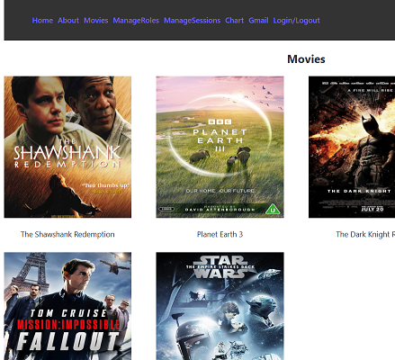
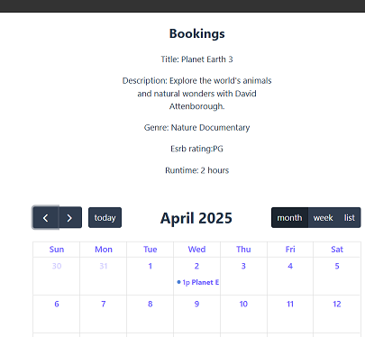
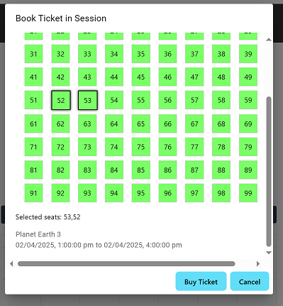

# Demo website for movie cinema

This is a personal project made by me for practice in web development. It is a webapp with server and client parts.
Users can register new accounts to view and book tickets. Admin user roles can edit sessions and roles, view graphs, and send emails.

## Features

Booking movie seats by calendar and UI
Authentication and roles - ASP.NET Identity, Google
Sending email - Gmail
Managing user roles and sessions
Map with routing
Graphs on ticket stats

## Tech stack and frameworks

Frontend: React.js
Backend: ASP.NET Core, C#, Javascript
Database: SQL Server

## Starting guide

Website was made and tested in Visual Studio IDE.

Admin user already registered is:

Username: Bg1234@gmail.com
Password: Au1256#ha

For email and Google authentication features
Add a OAuth2 ClientID and Gmail API key from Google developer console to
example.env and rename to .env

# Screenshots

